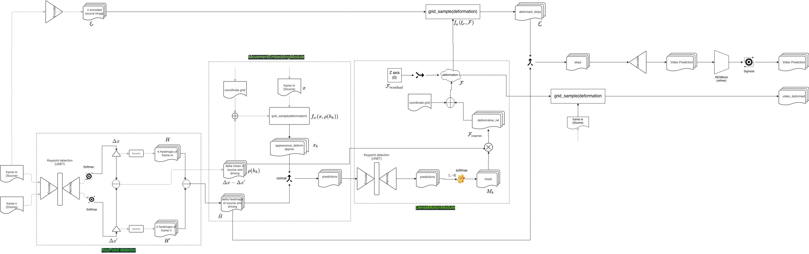

# Deep motion transfer using MonkeyNet


## **Install dependencies**
```bash
pip install -r requirements.txt
```

## **Train**
```bash
python main.py train --config yaml_path
```

## **Modules for training**

* Keypoint detection
* Movement embedding module
* Dense motion transfer

## **Detailed architecture**




